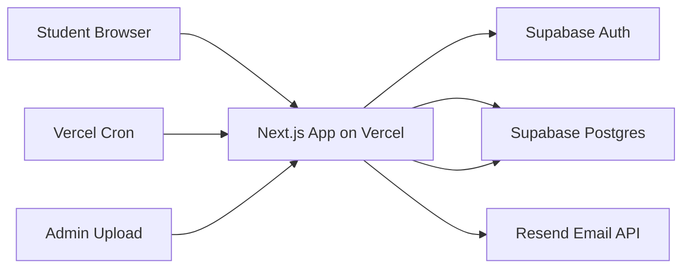

# Starter App Architecture for Next.js + Supabase + Vercel

## 1. Objective

Build a launchable MVP that is:

- fast to develop
- low-cost to host
- simple to operate
- easy to extend after pilot feedback

The recommended starter stack is:

- `Next.js` for the web app
- `Supabase` for auth and Postgres
- `Vercel` for deployment
- `Resend` for reminder emails

## 2. Why This Stack Fits the MVP

### Next.js

- strong fit for a web-first MVP
- supports server rendering, route protection, and server actions
- deploys easily on Vercel

### Supabase

- gives auth and Postgres in one setup
- supports row-level security
- easy to manage for a small team

### Vercel

- easiest deployment path for a Next.js app
- preview deploys make testing simple
- cron can be used for reminder workflows

### Resend

- simple email sending API
- good fit for weekly reminder emails

## 3. High-Level System Diagram



## 4. Architecture Principles

- Prefer server-rendered data for authenticated pages.
- Keep client-side state light.
- Use server actions for form submissions when possible.
- Keep content schema stable so admins can update plan content without redeploying.
- Compute the active plan day from the student start date instead of using a scheduler to assign content.

## 5. Suggested App Layers

### Presentation Layer

- pages and layouts
- reusable UI components
- forms and dashboards

### Domain Layer

- plan day calculation
- streak logic
- scoring logic for aptitude
- mission status transitions
- reminder decision rules

### Data Layer

- Supabase query helpers
- typed database responses
- RLS-aware read and write operations

### Integration Layer

- Supabase auth
- Resend emails
- Vercel cron entry point

## 6. Recommended Project Structure

```text
placement-project/
  app/
    (marketing)/
      page.tsx
    (auth)/
      login/page.tsx
      signup/page.tsx
      reset-password/page.tsx
    (app)/
      layout.tsx
      onboarding/page.tsx
      dashboard/page.tsx
      mission/[taskId]/page.tsx
      progress/page.tsx
      settings/page.tsx
    (admin)/
      admin/content/page.tsx
      admin/plan/[planId]/page.tsx
    api/
      cron/reminders/route.ts
      admin/import/route.ts
  components/
    auth/
    dashboard/
    mission/
    progress/
    admin/
    ui/
  lib/
    supabase/
      browser.ts
      server.ts
      middleware.ts
    auth/
      guards.ts
    plan/
      current-day.ts
      mission-loader.ts
      streaks.ts
    scoring/
      aptitude.ts
    reminders/
      build-email.ts
      send-weekly.ts
    validations/
      content-import.ts
      mission-submit.ts
  types/
    database.ts
    domain.ts
  supabase/
    migrations/
    seed.sql
  public/
  middleware.ts
  package.json
  vercel.json
```

## 7. Route Responsibilities

### `/`

- public landing page
- explain value proposition
- CTA to signup

### `/signup` and `/login`

- auth forms
- redirect signed-in users to dashboard

### `/onboarding`

- complete student profile
- create plan enrollment
- set reminder preferences

### `/dashboard`

- server-rendered summary page
- current mission card
- streak card
- progress overview
- pending backlog card

### `/mission/[taskId]`

- attempt UI
- answer submission
- score and explanation view
- mark complete action

### `/progress`

- week-wise history
- category breakdown
- milestone summary

### `/settings`

- profile edit
- timezone and reminder settings

### `/admin/content`

- upload CSV
- validation and preview
- publish plan

## 8. Auth and Authorization Pattern

### Authentication

- use Supabase email/password auth
- create authenticated route groups for student pages
- redirect unauthenticated users to `/login`

### Authorization

- `profiles.role = student` for regular users
- `profiles.role = admin` for content managers
- enforce access with:
  - route guards in Next.js
  - row-level security in Supabase

## 9. Data Fetching Pattern

### Recommended Approach

- use server components for dashboard and mission data
- use server actions for mission submissions and settings updates
- use client components only where interactivity is required:
  - MCQ selection
  - progress animation
  - CSV upload preview

### Why

- reduces client-side complexity
- keeps auth tokens on the server when possible
- works well with Supabase SSR helpers

## 10. Core Domain Services

### `current-day.ts`

Responsibility:

- compute current day number from `student_plans.start_date`
- clamp values between 1 and plan duration

### `mission-loader.ts`

Responsibility:

- fetch today's published task and child questions
- load student progress if it exists

### `aptitude.ts`

Responsibility:

- compare submitted option ids to correct options
- compute score percent
- prepare per-question correctness payload

### `streaks.ts`

Responsibility:

- compute current streak from completed task dates
- support milestone messages

### `send-weekly.ts`

Responsibility:

- find students due for reminder emails
- build summary payload
- send email through Resend

## 11. Mission Submission Flow

1. Student opens mission page.
2. Client form captures answers.
3. Server action validates payload with `zod`.
4. Server action upserts `user_task_progress`.
5. Server action inserts `question_attempts`.
6. If task type is `aptitude`:
   - score answers
   - set status to `solution_unlocked`
7. If task type is `dsa`, `sql`, or `hr`:
   - set status to `attempted`
   - allow user to unlock solution after confirming the attempt
8. On complete action:
   - update `completed_at`
   - set status to `completed`
   - revalidate dashboard and progress routes

## 12. Reminder Architecture

### MVP Approach

- use one daily Vercel cron route
- inside the cron handler:
  - fetch reminder preferences
  - evaluate student local timezone
  - send weekly reminder when due

### Why This Is Enough

- daily content does not need cron
- the mission day is computed from the student's plan start date
- only reminder email timing needs scheduling

### Cron Route

Suggested route:

- `/api/cron/reminders`

Protect it with:

- `CRON_SECRET`

## 13. Admin Content Import Strategy

### MVP Choice

Use CSV upload instead of building a rich CMS.

### Flow

1. Admin uploads CSV.
2. Server validates column structure and required fields.
3. Server transforms rows into:
   - `plan_days`
   - `tasks`
   - `task_questions`
   - `question_options`
4. Server upserts content into Supabase.
5. Admin previews the imported plan and publishes it.

### Benefit

This keeps content operations simple for the first launch.

## 14. Environment Variables

```env
NEXT_PUBLIC_APP_URL=
NEXT_PUBLIC_SUPABASE_URL=
NEXT_PUBLIC_SUPABASE_ANON_KEY=
SUPABASE_SERVICE_ROLE_KEY=
RESEND_API_KEY=
REMINDER_FROM_EMAIL=
CRON_SECRET=
```

Optional:

```env
ADMIN_EMAILS=
SENTRY_DSN=
```

## 15. Recommended NPM Packages

- `@supabase/supabase-js`
- `@supabase/ssr`
- `zod`
- `react-hook-form`
- `date-fns`
- `clsx`
- `tailwindcss`
- `lucide-react`

Optional:

- `papaparse` for CSV parsing
- `sentry` for error reporting

## 16. UI and Styling Recommendation

Use:

- `Tailwind CSS` for fast styling
- a small custom component layer instead of a heavy design system

MVP visual tone:

- clear
- motivating
- mobile-friendly
- progress-oriented

Avoid making the first version feel like an exam platform. It should feel like a guided study companion.

## 17. Security Checklist

- enable row-level security on all student data tables
- use service-role key only in trusted server environments
- never expose admin actions to client-side code
- validate all CSV imports
- validate mission submissions with schema checks
- protect cron route with a secret header

## 18. Testing Strategy

### Unit Tests

- current day calculation
- aptitude scoring
- streak logic
- reminder due logic

### Integration Tests

- signup to onboarding to dashboard flow
- mission attempt and completion flow
- admin CSV import validation

### Manual QA

- mobile mission flow
- solution unlock behavior
- weekly reminder email content

## 19. Deployment Plan

### Supabase Setup

1. Create Supabase project.
2. Run SQL migrations.
3. Seed admin user and sample 7-day content.
4. Enable auth providers.
5. Enable RLS policies.

### Vercel Setup

1. Push code to GitHub.
2. Import repo into Vercel.
3. Add environment variables.
4. Configure cron route.
5. Deploy preview and production.

### Resend Setup

1. Create account.
2. Verify sender domain.
3. Add API key to Vercel.
4. Test reminder email from staging.

## 20. Recommended Build Milestones

### Milestone 1

- project scaffold
- auth
- database schema
- seed sample content

### Milestone 2

- dashboard
- mission page
- aptitude scoring
- completion tracking

### Milestone 3

- progress page
- settings
- admin CSV import
- reminder emails

### Milestone 4

- QA
- pilot data reset
- production deploy

## 21. Launch Readiness Standard

The app is ready for MVP launch when:

- a student can sign up and start Day 1
- a daily mission loads correctly
- the student can attempt, unlock solution, and complete it
- progress and streaks update correctly
- admin can upload plan content
- weekly reminders are being sent successfully

## 22. Recommended Immediate Next Step

After approving this architecture, the next engineering move should be:

1. scaffold the Next.js app
2. add Supabase auth integration
3. create the database migrations
4. seed 7 sample days
5. build the dashboard and mission flow first

That sequence gives the fastest path to a working pilot.
